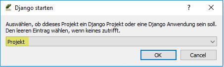
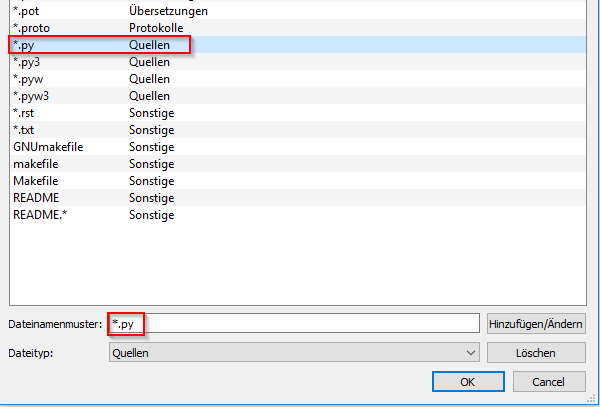
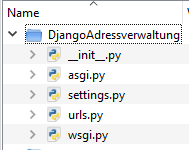
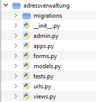

# Dokumentation Django Adressverwaltung

## Anforderung
Die Aufgabenstellung für diese Übung war es, unsere Adressverwaltung, die wir zu Beginn in Python programmiert haben, in eine Web-App. umzuwandeln. Als Grundlage dazu dient unsere Erfahrung mit der Erstellung der Web-App DjangoGirls, bei der wir einen Blog erstellt haben. 

> **Voraussetzungen**
> - Installation von Django
> - Installation von Python
> - Verwendung einer geeigneten IDE (muss nicht sein, vereinfacht aber das Arbeiten)
> - funktionierende Internetverbindung

## Umsetzung

### Erstellung eines neuen Projekts

Bei der Erstellung eines neuen Projekts gilt es zu beachten, dass der Projekttyp Django ist.


Im nächsten Schritt wird man gefragt, ob es sich um eine Django Anwendung oder ein Projekt handelt. Hier ist die Auswahl ***Projekt*** auszuwählen. 



Danach hat man die Möglichkeit bereits exisitierende Dateien dem Projekt hinzuzufügen. Diese Frage ist mit ***ja*** zu beantworten. Dann öffnet sich ein Fenster, indem man die Dateiendungen der hinzuzufügenden Dateien auswählen kann. Hier gehört die Endung ***.py*** ausgewählt.



Jetzt wurde das Projekt erfolgreich erstellt und man sieht in Eric6, dass in der Projektanzeige bereits einen Ordner mit ein paar Python-Files gibt. Diese wurden durch das Hinzufügen der ***.py*** Dateien automatisch erzeugt.



### erste Schritte

> wenn in den nächsten Absätzen davon geredet wird, dass etwas in die PowerShell einzugeben ist, dann ist diese immer aus dem **Projektordner** gestartet worden!
<br>
Um die PowerShell aus dem Projektordner zu starten, muss man einfach nur mit ***SHIFT+linkeMaustaste*** die Option ***PowerShell hier öffnen*** auswählen.

Um von Beginn an eine saubere Struktur beizubehalten, wird für die eigentliche App eine neue Anwendung im Projekt erstellt. Dafür wird folgendes Kommando in die PowerShell eingegeben: 

```python
python manage.py startapp [Name der App]
```

Damit wird ein neues Verzeichnis erstellt, in welchem der Großteil der benötigten Python-Dateien schon von selbst erstellt wurde.




