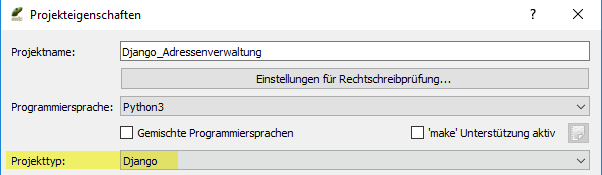
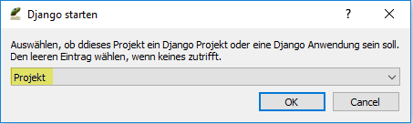
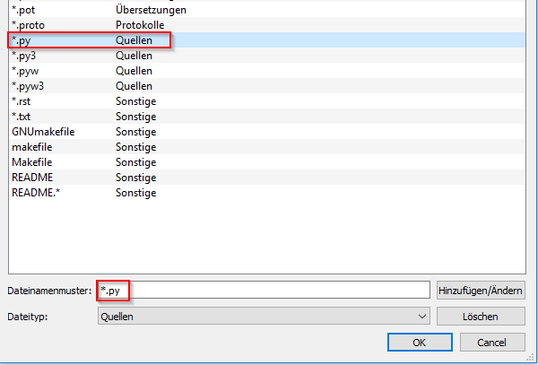
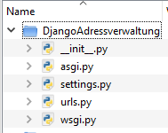
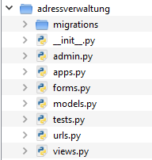
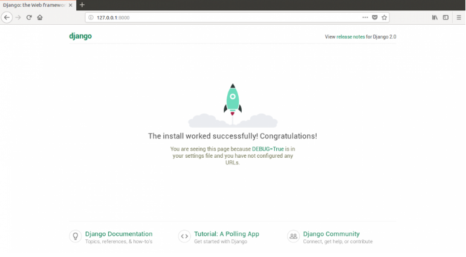
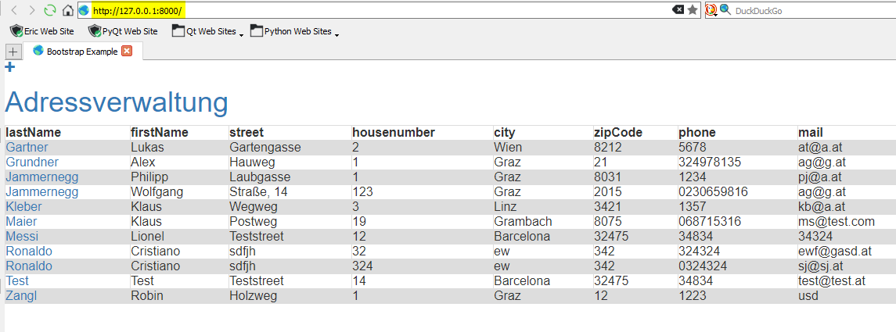
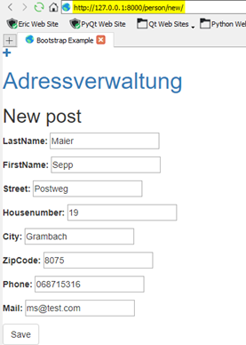
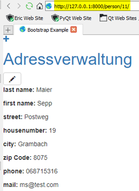

# Dokumentation Django Adressverwaltung

## Anforderung
Die Aufgabenstellung für diese Übung ist es, unsere Adressverwaltung, die wir zu Beginn in Python programmiert haben, in eine Web-App umzuwandeln. Als Grundlage dazu dient die Erfahrung, welche wir bei der Erstellung der Web-App DjangoGirls gewonnen haben.

 **Voraussetzungen**
 - Installation von Django
 - Installation von Python
 - Verwendung einer geeigneten IDE
 - funktionierende Internetverbindung

## Umsetzung

### Erstellung eines neuen Projekts

Bei der Erstellung eines neuen Projekts gilt es zu beachten, dass der Projekttyp Django ist.



Im nächsten Schritt wird man gefragt, ob es sich um eine Django Anwendung oder ein Projekt handelt. Hier wählt man ***Projekt*** aus.



Danach hat man die Möglichkeit bereits exisitierende Dateien dem Projekt hinzuzufügen. Diese Frage ist mit ***ja*** zu beantworten, dann öffnet sich ein Fenster, indem man die Dateiendungen der hinzuzufügenden Dateien auswählen kann. Hier gehört nur die Endung ***.py*** ausgewählt.



Jetzt wurde das Projekt erfolgreich erstellt und man sieht in Eric6, dass es in der Projektanzeige bereits einen Ordner mit ein paar Python-Files gibt. Diese wurden durch das Hinzufügen der ***.py*** Dateien automatisch erzeugt.



### Erste Schritte

> Wenn in den nächsten Absätzen etwas in die PowerShell eingegeben wird, dann ist diese **immer aus dem Projektordner gestartet** worden!
<br>
Dafür wählt man mit ***SHIFT + rechte Maustaste*** die Option ***PowerShell hier öffnen*** aus.

Um von Beginn an eine saubere Struktur beizubehalten, wird für die eigentliche App eine neue Anwendung im Projekt erstellt. Dafür wird folgendes Kommando in die PowerShell eingegeben:

```
python manage.py startapp [Name der App]
```

In dem neu erstellen Verzeichnis wurde der Großteil der benötigten Python-Dateien bereits automatisch erstellt.



### Einstellungen anpassen

Im den Files **settings.py** und **urls.py** des Projektordnerns müssen ein paar Einstellungen angepasst werden, um mit der neu erstellten Anwendung arbeiten zu können.

***settings.py***
```python
INSTALLED_APPS = [
    'django.contrib.admin',
    'django.contrib.auth',
    'django.contrib.contenttypes',
    'django.contrib.sessions',
    'django.contrib.messages',
    'django.contrib.staticfiles',
    'adressverwaltung.apps.AdressverwaltungConfig' # muss angeben werden, um die neu erstellte Anwendung für das Projekt verwenden zu können
]
# am Ende des Files (unter STATIC_URL) muss der Pfad für statische Dateien festgelegt werden 
STATIC_ROOT = os.path.join(BASE_DIR, 'static')
```

***urls.py***

```python
urlpatterns = [
    path('admin/', admin.site.urls),
    path('',  include('adressverwaltung.urls')), # alle Aufrufe des localhost / 127.0.0.1 werden auf adressverwaltung.urls umgeleitet und suchen dort nach neuen Anweisungen
]
```

<div style="page-break-after: always"></div>

### Datenbank erstellen und Webserver starten

Django verwendet standardgemäß SQLite als Datenbank für seine Anwendungen. Diese muss mit folgendem Kommando in der PowerShell neu erstellt werden:

```
python manage.py migrate
```

Mit dem Kommando

```
python manage.py runserver
```

wird der Webserver gestartet. Dieser kann auch aus Eric6 gestartet werden starten, ist aber nicht empfehlenswert. In der PowerShell ist es einfacher den Server wieder zu stoppen und man hat auch gleichzeitig ein Log, womit man besser nachvollziehen kann, was passiert.

Öffnet man im Webbrowser den Localhost (127.0.0.1) sollte man auf folgende Seite gelangen:


<br>
<br>
<br>
<br>
<br>
> ab jetzt wird nur mehr in der Anwendung gearbeitet (in diesem Fall mit den Files im Ordner adressverwaltung)

<div style="page-break-after: always"></div>

### Model erstellen

In der **models.py** wird eine Klasse erstellt, die als Vorlage für zukünftige Objekte dienen soll.

```python
class Person(models.Model): # models.Model gibt an, dass es sich um ein Django-Model handelt → Django weiß dadurch, dass es in der Datenbank gespeichert werden soll
    firstName = models.CharField(max_length = 100)
    lastName = models.CharField(max_length = 100)
    street = models.CharField(max_length = 100)
    housenumber  = models.IntegerField()
    city = models.CharField(max_length = 100)
    zipCode = models.IntegerField() # keine max_length bei Int-Feldern → führt zu Warnings bei DB-Migration
    phone = models.CharField(max_length = 100)
    mail = models.CharField(max_length = 100)
    
    def publish(self): #Methode zur Speicherung
        self.save()
```

Das erstellte Model gehört noch der Datenbank hinzugefügt. Dafür muss Django aber zuerst wissen, dass Änderungen am Model vorgenommen wurden. Das geschieht mit den folgenden zwei Befehlen:

```
python manage.py makemigrations adressverwaltung
python manage.py migrate adressverwaltung
```

### Views erstellen

In der **view.py** wird die Logik des Programms geschrieben. Darin werden Informationen aus den Models abgefragt und an die Templates weitergegeben.

```python
from django.shortcuts import render,  get_object_or_404,  redirect
# get_object_or_404: gibt den Error 404 aus, wenn keine passende Seite gefunden wird
from .models import Person # Model importieren
from .forms import PostForm # Form importieren

# das anzuzeigende Model wird dem Template übergeben
def post_list(request):
    person = Person.objects.order_by('lastName') # Abfrage: Einträge werden nach Nachnamen sortiert
    return render(request,  'adressverwaltung/post_list.html', {'person':person})
    # {'person':person}: übergebe Abfrage an Template und 'person' ist der Name, mit dem diese im HTML-Dok. verwenden kann
    # return render gibt die fertig gerenderte/zusammengesetzte HTML-Seite (post_list.html) zurück
```

```python
# detailierte Ansicht einer Person    
def post_detail(request,  pk):
    person= get_object_or_404(Person,  pk=pk)
    return render(request,  'adressverwaltung/post_detail.html',  {'person':person})

# Anlegen einer neuen Person
def post_new(request):
    if request.method == "POST": # um mit allen Eingaben zurück zur View zu gelangen
        form = PostForm(request.POST) # Form wird mit Eingabedaten erstellt
        form.is_valid() #Form wird auf Gültigkeit geprüft (wurden alle Felder mit korrekten Eingaben befüllt)
        if form.is_valid():
            person = form.save(commit=False)
            person.save()
            return redirect('post_detail',  pk=person.pk) # leitet zur Detailansicht einer Person weiter
    else: # wenn das erste Mal auf die Seite zugegriffen wird, wird ein leeres Formular benötigt
        form = PostForm()
    return render(request,  'adressverwaltung/post_edit.html',  {'form':form})

# Bearbeiten bereits vorhandener Einträge
def post_edit(request,  pk): # Funktionsweise gleich wie bei post_new, mit dem Unterschied, dass bereits die Daten der Person in den Eingabefeldern angezeigt werden
    person = get_object_or_404(Person,  pk=pk)
    if request.method == "POST": 
        form = PostForm(request.POST,  instance = person)
        if form.is_valid():
            person = form.save(commit=False)
            person.save()
            return redirect('post_detail',  pk=person.pk)
    else: 
        form = PostForm(instance=person)
    return render(request,  'adressverwaltung/post_edit.html',  {'form':form})
```

<div style="page-break-after: always"></div>

### Urls bearbeiten

Die Datei **urls.py** muss erst neu erstellt werden und soll vom Stil der schon vorhandenen urls.py gleichen.
Der *name* gibt Aufschluss darüber, welche View verwendet werden soll.

```python
from django.urls import path
from . import views

urlpatterns = [
    path('',  views.post_list,  name='post_list'), # Aufruf der Webseite
    path('person/<int:pk>/',  views.post_detail,  name='post_detail'), # Anzeigen einer Person im Detail
    # <int:pk>: Django erwarteteinen Integer-Wert und gibt diesen in Form einer Variablen (pk) einer View weiter.
    path('person/new/',  views.post_new,  name='post_new'), # Anlegen einer neuen Person
    path('person/<int:pk>/edit/', views.post_edit, name='post_edit'), # Person bearbeiten
]
```

### Form erstellen

Das File **form.py** muss neu erstellt werden. Darin wird die Eingabe erstellt um neue Einträge hinzuzufügen oder bereits Vorhandene zu bearbeiten.

```python
from django import forms # Django Forms importieren
from .models import Person # Model importieren

class PostForm(forms.ModelForm): # PostForm = Name der Form
    class Meta: # gibt an, welches Model verwendet werden soll
        model = Person
        fields = ('lastName',  'firstName',  'street',  'housenumber', 'city',  'zipCode',  'phone',  'mail') # Angabe der benötigten Felder
```

### Templates erstellen

Die Templates dienen zur einheitlichen Darstellung von Informationen, sodass das Grundgerüst gleicht bleibt und sich nur die Inhalte verändern. Geschrieben werden diese in HTML.

Man kann für jede Seite die angezeigt werden soll ein eigenes HTML-Dokument verfassen, was recht umständlich ist.

Hier wird ein Basis-File erstellt, welches als Grundlage für alle Seiten dient und auf jeder einzelnen Seite erweitert wird.

>Um Daten aus den Views darstellen zu können werden in Django zwei geschweifte Klammern {{ }} verwendet.

**base.html**

Am Anfang des Files werden mit ****** die statischen Dateien (z.B.: CSS/HTML-Dateien) geladen.

****** und ****** kennzeichnen einen Bereich der HTML aufnehmen kann, das aufgenommene HTML kommt aber aus einem anderen HTML-File und erweitert diese Seite.

```html

<html>
<head>
  <title>Bootstrap Example</title>
  <style>
      table{
        font-family: arial, sans-serif;
        border-collapse: collapse;
        width: 100%;
      }
      td, th {
          border: 1px solid #dddddd;
          text-align: left;
          padding: 8px;
        }
        tr:nth-child(even) {
            background-color: #dddddd;
        }
  </style>
  <meta charset="utf-8">
  <meta name="viewport" content="width=device-width, initial-scale=1">
  <link rel="stylesheet" href="https://maxcdn.bootstrapcdn.com/bootstrap/3.4.0/css/bootstrap.min.css">
</head>
<body>
    <div>
        <a href="" class="top-menu"><span class="glyphicon glyphicon-plus"></span></a>
        <h1><a href="/">Adressverwaltung</a></h1>
    </div>
                
                
</body>
</html>
```

**post_list.html**

Dient zur Anzeige der Objekte. Django versteht die Query als Liste von Objekten, welche über eine for-Schleife ausgegeben werden können.

Das Basis-HTML-Dokument wird um eine Tabelle erweitert, in der alle gespeicherten Personen angezeigt werden. Dafür muss der anzuzeigende Code mit ** - ** eingeschlossen werden. Im letzten Schritt muss zu Beginn des Files angegeben werden, dass dieses das Basis-File erweitern soll.

Klickt man auf einen der angezeigten Nachnamen, so kommt man zu einer neuen Seite, in der man eine detailierte Ausgabe der gespeicherten Daten hat.

pk=x.pk → damit wird auf den PrimaryKey zugegriffen, der Name des Feldes ist dabei irrelevant. Da in der Anwendung kein PrimaryKey angelegt wurde, macht Django das und fügt diesen als Feld zu jeder angelegten Person hinzu.

```html



    <div>
        <table>
            <tr>
                <th>lastName</th>
                <th>firstName</th>
                <th>street</th>
                <th>housenumber</th>
                <th>city</th>
                <th>zipCode</th>
                <th>phone</th>
                <th>mail</th>
                </tr>        
                
                <tr>
                <td><a href="">{{x.lastName}}</a></td>
                <td>{{x.firstName}}</td>
                <td>{{x.street}}</td>
                <td>{{x.housenumber}}</td>
                <td>{{x.city}}</td>
                <td>{{x.zipCode}}</td>
                <td>{{x.phone}}</td>
                <td>{{x.mail}}</td>
                </tr>
                        
            </table>
        </div>  

```

<div style="page-break-after: always"></div>

***post_detail.html***

Dient zur detailierten Anzeige einer Person.

```html



    <div class="post">
        <a class="btn btn-default" href=""><span class="glyphicon glyphicon-pencil"></span></a>
        <p><b>first name:</b> {{person.firstName}}</p>
        <p><b>street:</b> {{person.street}}</p>
        <p><b>housenumber:</b> {{person.housenumber}}</p>
        <p><b>city:</b> {{person.city}}</p>
        <p><b>zip Code:</b> {{person.zipCode}}</p>
        <p><b>phone:</b> {{person.phone}}</p>
        <p><b>mail:</b> {{person.mail}}</p>
    </div>

```

***post_edit.html***

Dient zum Anlegen/Editieren einer Person

```html


    <h2>New post</h2>
    <form method="POST" class="post-form">
        {{ form.as_p }}
        <button type="submit" class="save btn btn-default">Save</button>
    </form>

```

<div style="page-break-after: always"></div>

## Ergebnis

**Startseite:**



**neuen User anlegen:**



<div style="page-break-after: always"></div>

**Detailansicht**



**Person editieren:**


